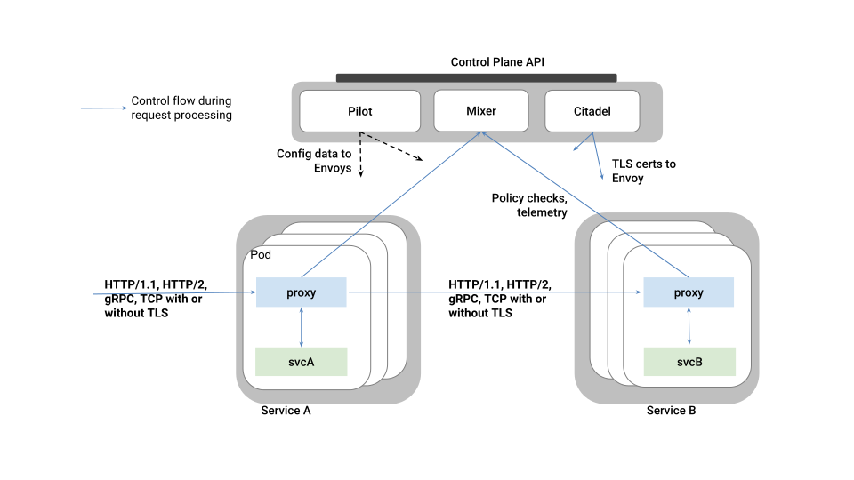

# Service Mesh with Istio 

## What is Service Mesh and Istio

A *service mesh* is a dedicated infrastructure layer for making service-to-service communication safe, fast, and reliable.

Istio is a service mesh which allows you to connect, manage and secure your microservices in an easy and none intrusive way.

Some of the features that offers Istio are:

* Intelligent routing and load balancing
* Resilience against network failures
* Policy enforcement between services
* Observability of your architecture. Tracing and Metrics
* Securing service to service communication

### Istio Architecture

Istio is composed by two major components:

* **Data plane** which is composed of *Envoy* proxies deployed as sidecar container along with your service for managing network along with policy and telemetry features.
* **Control plane** which is in charge of managing and configuring all *Envoy* proxies.

All communication within your *service mesh* happens through *Envoy* proxy, so any network logic to apply is moved from your service into your infrastructure.

## Key Concepts of Istio

### DestinationRule

A *DestinationRule* configures the set of rules to be applied when forwarding traffic to a service.
Some of the purposes of a *DestinationRule* are describing circuit breakers, load balancer and TLS settings or define *subsets* (named versions) of the destination host so they can be reused in other Istio elements.

For example to define two services based on version label of a service with hostname *recommendation* you could do:

~~~
apiVersion: networking.istio.io/v1alpha3
kind: DestinationRule
metadata:
  name: recommendation
  namespace: tutorial
spec:
  host: recommendation
  subsets:
  - labels:
      version: v1
    name: version-v1
  - labels:
      version: v2
    name: version-v2
~~~

### VirtualService

A *VirtualService* describes the mapping between one or more user-addressable destinations to the actual destination inside the mesh.

As its name suggests a *VirtualService* are virtual destinations, so they are not registered into any service registry.

For example, to define two virtual services where the traffic is splitted between 50% to each one.

~~~
apiVersion: networking.istio.io/v1alpha3
kind: VirtualService
metadata:
  name: recommendation
  namespace: tutorial
spec:
  hosts:
  - recommendation
  http:
  - route:
    - destination:
        host: recommendation
        subset: version-v1
      weight: 90
    - destination:
        host: recommendation
        subset: version-v2
      weight: 10
~~~

### ServiceEntry

A *ServiceEntry* is used to configure traffic to external services of the mesh such as APIs or legacy systems.
You can used it in conjunction with a *VirtualService* and/or *DestinationRule*.

For example to configure _httpbin_ external service:

~~~
apiVersion: networking.istio.io/v1alpha3
kind: ServiceEntry
metadata:
  name: httpbin-egress-rule
  namespace: istioegress
spec:
  hosts:
  - httpbin.org
  ports:
  - name: http-80
    number: 80
    protocol: http
~~~

### Gateway

A *Gateway* is used to describe a load balancer operating at the edge of the mesh for incoming/outgoing HTTP/TCP connections.
You can bind a *Gateway* to a *VirtualService*.

To configures a load balancer to allow external https traffic for host foo.com into the mesh:

~~~
apiVersion: networking.istio.io/v1alpha3
kind: Gateway
metadata:
  name: foo-gateway
spec:
  servers:
  - port:
      number: 443
      name: https
      protocol: HTTPS
    hosts:
    - foo.com
    tls:
      mode: SIMPLE
      serverCertificate: /tmp/tls.crt
      privateKey: /tmp/tls.key
~~~

## Getting started with Istio

*Istio* can be installed with _automatic sidecar injection_ or withoutit.
We recommend as starting point *without* _automatic sidecar injection_ so you understand each of the steps.

### Installing Istio

First you need to download Istio and register in `PATH`:

~~~
curl -L https://github.com/istio/istio/releases/download/0.8.0/istio-0.8.0-osx.tar.gz | tar xz

cd istio-0.8.0
export ISTIO_HOME=`pwd`
export PATH=$ISTIO_HOME/bin:$PATH
~~~

You can install Istio into Kubernetes cluster by either using `helm install` or `helm template`.

~~~
$ helm template install/kubernetes/helm/istio --name istio --namespace istio-system --set sidecarInjectorWebhook.enabled=false > $HOME/istio.yaml

kubectl create namespace istio-system
kubectl create -f $HOME/istio.yaml
~~~

Wait until all pods are up and running.

### Intelligent Routing

Routing some percentage of traffic between two versions of recommendation service:

~~~
apiVersion: networking.istio.io/v1alpha3
kind: VirtualService
metadata:
  name: recommendation
  namespace: tutorial
spec:
  hosts:
  - recommendation
  http:
  - route:
    - destination:
        host: recommendation
        subset: version-v1
      weight: 75
    - destination:
        host: recommendation
        subset: version-v2
      weight: 25
~~~

Routing to specific version in case of prefixed URI and cookie with a value matching a regular expression:

~~~
spec:
  hosts:
  - ratings
  http:
  - match:
    - headers:
        cookie:
          regex: "^(.*?;)?(user=jason)(;.*)?"
        uri:
          prefix: "/ratings/v2/"
    route:
    - destination:
        host: ratings
        subset: version-v2
~~~

Possible **match** options:

|	Field		          | Type          |Description                                                 	|
| ------------------|---------------|-------------------------------------------------------------|
|	**uri**	          | `StringMatch` | URI value to match. `exact`, `prefix`, `regex`           	  |
| **scheme**        | `StringMatch` | URI Scheme to match. `exact`, `prefix`, `regex`             |
| **method**        | `StringMatch` | Http Method to match. `exact`, `prefix`, `regex`            |
| **authority**     | `StringMatch` | Http Authority value to match. `exact`, `prefix`, `regex`         |
| **headers**       | `map<string, StringMatch>` | Headers key/value. `exact`, `prefix`, `regex`         |
| **port**          | int           | Set port being addressed. If only one port exposed, not required |
| **sourceLabels**  | `map<string, string`> | Caller labels to match                              |
| **gateways**      | string[]      | Names of the gateways where rule is applied to.             |

Sending traffic depending on caller labels:

~~~
- match:
  - sourceLabels:
      app: preference
      version: v2
  route:
  - destination:
      host: recommendation
      subset: version-v2
- route:
  - destination:
      host: recommendation
      subset: version-v1
~~~

When caller contains labels `app=preference` and `version=v2` traffic is routed to **subset** `version-v2` if not routed to `version-v1`

Mirroring traffic between two versions:

~~~
spec:
  hosts:
  - recommendation
  http:
  - route:
    - destination:
        host: recommendation
        subset: version-v1
    mirror:
      host: recommendation
      subset: version-v2
~~~

For routing purposes `VirtualService` also supports **redirects**, **rewrites**, **corsPolicies** or *appending* custom headers.

Apart from HTTP rules, `VirtualService` also supports matchers at _tcp_ level.

~~~
spec:
  hosts:
  - postgresql
  tcp:
  - match:
    - port: 5432
      sourceSubnet: "172.17.0.0/16"
    route:
    - destination:
        host: postgresql
        port:
          number: 5555
~~~

Possible **match** options at _tcp_ level:

|	Field		              | Type          |Description                                                 	|
| ----------------------|---------------|-------------------------------------------------------------|
|	**destinationSubnet**	| string        | IPv4 or IPv6 of destination with optional subnet        	  |
| **port**              | ini           | Set port being addressed. If only one port exposed, not required |
| **sourceSubnet**      | string        | IPv4 or IPv6 of source with optional subnet                 |
| **sourceLabels**  | `map<string, string`> | Caller labels to match                                  |
| **gateways**      | string[]      | Names of the gateways where rule is applied to.                 |

### Resilience

Retry 3 times when things go wrong before throwing the error upstream.

~~~
apiVersion: networking.istio.io/v1alpha3
kind: VirtualService
metadata:
  name: recommendation
  namespace: tutorial
spec:
  hosts:
  - recommendation
  http:
  - retries:
      attempts: 3
      perTryTimeout: 4.000s
    route:
    - destination:
        host: recommendation
        subset: version-v1
~~~

You can add timeouts to communications, for example aborting call after 1 second:

~~~
http:
- route:
  - destination:
      host: recommendation
  timeout: 1.000s
~~~

If the request is forwarded to a certain instance and it fails (e.g. returns a 50x error code), then this instance of an instance/pod is ejected to serve any other client request for an amount of time.
In next example there must occurs 5 consecutive errors before pod is ejected, ejection analysis occurs every 15 seconds, in case of ejection host will be ejected for 2 minutes and any host can be ejected.

~~~
apiVersion: networking.istio.io/v1alpha3
kind: DestinationRule
metadata:
  name: recommendation
  namespace: tutorial
spec:
  host: recommendation
  trafficPolicy:
    outlierDetection:
      http:
        baseEjectionTime: 2m
        consecutiveErrors: 5
        interval: 15.000s
        maxEjectionPercent: 100
  subsets:
~~~

`trafficPolicy` can be applied at subset level to make it specific to a subset instead of all them.

You can also create connection pools at _tcp_ and _http_ level:

~~~
trafficPolicy:
  connectionPool:
    http:
      http1MaxPendingRequests: 100
      http2MaxRequests: 100
      maxRequestsPerConnection: 1
    tcp:
      maxConnections: 100
      connectTimeout: 50ms
~~~

Traffic Policy possible values:

|	Field		              | Type                    | Description                                                	|
| ----------------------|-------------------------|-------------------------------------------------------------|
|	**loadbalancer**	    | `LoadBalancerSettings`  | Controlling load blancer algorithm                       	  |
| **connectionPool**    | `ConnectionPoolSettings`| Controlling connection pool                                 |
| **outlierDetection**  | `OutlierDetection`      | Controlling eviction of unhealthy hosts                     |
| **tls**               | `TLSSettings`           | TLS settings for connections                                |
| **portLevelSettings** | `PortTrafficPolicy[]`   | Traffic policies specific to concrete ports                 |

### Policy Enforcement

Istio provides a model to enforce authorization policies in the communication between policies.
You can for example black-list or white-list intercommunication between services or add some quota.

You can configure that preference service only allows requests from the recommendation service.

~~~
apiVersion: "config.istio.io/v1alpha2"
kind: listchecker
metadata:
  name: preferencewhitelist
spec:
  overrides: ["recommendation"]
  blacklist: false
---
apiVersion: "config.istio.io/v1alpha2"
kind: listentry
metadata:
  name: preferencesource
spec:
  value: source.labels["app"]
---
apiVersion: "config.istio.io/v1alpha2"
kind: rule
metadata:
  name: checkfromcustomer
spec:
  match: destination.labels["app"] == "preference"
  actions:
  - handler: preferencewhitelist.listchecker
    instances:
    - preferencesource.listentry
~~~

Source part is configured by using `listchecker` (to provide the list of allows hosts) and `listentry` (to configure how to get white list value from request) elements.
Destination part andrule is configured by using `rule` element.

|	Field		              | Type                    | Description                                                	|
| ----------------------|-------------------------|-------------------------------------------------------------|
|	**providerUrl**	      | string                  | Url where to load the list to check against, can be empty   |
| **refreshInterval**   | `Duration`              | How often provider is polled                                |
| **ttl**               | `Duration`              | How long keep list before discarding it                     |
| **cachingInterval**   | `Duration`              | How long a caller can cache an answer befoer ask again      |
| **cachingUseCount**   | int                     | Number of times a caller can use a cached answer            |
| **overrides**         | string[]                | List of entries consulted first before `providerUrl`        |
| **entryType**         | `ListEntryType`         | The kind (`STRINGS`, `CASE_INSENSITIVE_STRINGS`, `IP_ADDRESSES, `REGEX`) of list entry and overrides                        |
| **blacklist**         | boolean                 | the list operates as a blacklist or a whitelist             |

### Telemetry, Monitoring and Tracing

¿¿¿¿¿(special headers for zipking/jaeger)?????

### Service to Service Security

###This Is a Second-Level Header
This is the body text of the Refcard. Use two asterisks for **bold words** and one asterisk for *italic words*. **Use one underscore to create _italics_ within bold text.** _Or you can have **bold text** within italics._

To add inline code, surround the code with backticks: `public static void main (String[] args)`.

Start new paragraphs with one blank line between the two paragraphs.

Code blocks should be formatted normally and surrounded above and below by three tildes:

~~~
System.out.println("Try to keep code lines <60 chars.");
for(int i = 0; i < 2; i++){    
    if(2 + 2 != 5){
        System.out.println("Keep code neat!");
    }
}
~~~

Build tables with vertical bars/pipes:

|	Table Headings		| Go Above at Least Three Dashes	|
| -------------------	| ------------------------------	|
|	**For inline code**	|	`You can use backticks as normal`	|
|	**For spacing**		|	Keep at least one space or tab between your content and the pipes.	|
|	**Try to keep it neat**		|	But if necessary, the pipes do not have to align.	|

For links, enclose the content to be linked in square brackets, followed directly by the URL in parentheses: [This is DZone's Refcardz page.](https://dzone.com/refcardz)

Keep all images collected in a folder. To reference an image, use an exclamation point, followed by the alt text in square brackets (for the web version of the content), followed then by parentheses enclosing the following: the image directory and filename, one space, and then the image title in quotes.

All images should be on their own line.

Ordered list items should have the number, a period, a space, and then the content of that item. You can then continue your list with numbers on new lines.

1. This is the first item of an ordered list.
2. This is the second item of an ordered list.

Use the plus sign then a space for unordered lists.

+ This is an unordered list item.
+ Here is another.

    Blank lines above and below, and leading spaces before the content, will let you create new paragraphs within the list.

+ You can then return to your list items as normal.

